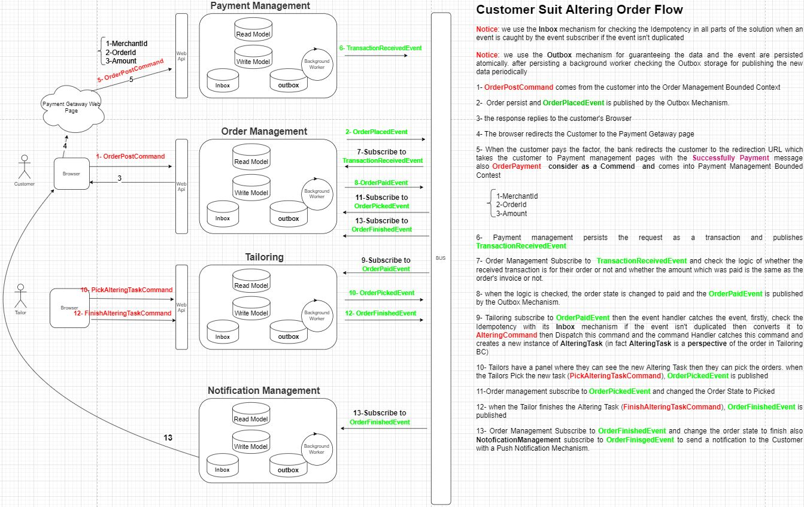

# Suit Supply APP

This application is responsible to handle customers request for altering their suit, such as altering teir suit sleeves and trousers. 

## Introduction
A customer brings a suit that needs altering (shorten sleeves, shorten trousers).
A Sales associate needs a way to enter these alterations.
Once the payment for the alteration has been received, a tailor will pick the suit and do the alterations.
When he is finished, the customer will be notified that the suit is ready to be picked up

## Architecture
[Click Here to see Big Picture Diagram  in app.diagrams.net ](https://drive.google.com/file/d/1Rk1-0pOWAwpwSserQQQ1TMPW87-XAdnR/view?usp=sharing)

## Customer Suit Altering Order Flow
Notice: we use the Inbox mechanism for checking the Idempotency in all parts of the solution when an event is caught by the event subscriber if the event isn't duplicated 

Notice: we use the Outbox mechanism for guaranteeing the data and the event are persisted atomically. after persisting a background worker checking the Outbox storage for publishing the new data periodically
1- OrderPostCommand comes from the customer into the Order Management Bounded Context

2-  Order persist and OrderPlacedEvent is published by the Outbox Mechanism.

3- the response replies to the customer's Browser 

4- The browser redirects the Customer to the Payment Getaway page

5- When the customer pays the factor, the bank redirects the customer to the redirection URL which takes the customer to Payment management pages with the Successfully Payment message also OrderPayment  consider as a Commend  and comes into Payment Management Bounded Contest

6- Payment management persists the request as a transaction and publishes TransactionReceivedEvent

7- Order Management Subscribe to  TransactionReceivedEvent and check the logic of whether the received transaction is for their order or not and whether the amount which was paid is the same as the order's invoice or not.  

8- when the logic is checked, the order state is changed to paid and the OrderPaidEvent is published by the Outbox Mechanism.

9- Tailoring subscribe to OrderPaidEvent then the event handler catches the event, firstly, check the Idempotency with its Inbox mechanism if the event isn't duplicated then converts it to AlteringCommand then Dispatch this command and the command Handler catches this command and creates a new instance of AlteringTask (in fact AlteringTask is a perspective of the order in Tailoring BC)

10- Tailors have a panel where they can see the new Altering Task then they can pick the orders. when the Tailors Pick the new task (PickAlteringTaskCommand), OrderPickedEvent is published 
11-Order management subscribe to OrderPickedEvent and changed the Order State to Picked

12- when the Tailor finishes the Altering Task (FinishAlteringTaskCommand), OrderFinishedEvent is published

13- Order Management Subscribe to OrderFinishedEvent and change the order state to finish also NotoficationManagement subscribe to OrderFinisgedEvent to send a notification to the Customer with a Push Notification Mechanism.

## Development
### restore
To restore your application, run:
- dotnet restore "OMS.AkkaLighthouse.csproj"
- dotnet restore "OMS.AkkaActorSystem.csproj"
- dotnet restore "OMS.ServiceHost.csproj"

### build
To build your application, run:
- dotnet build "OMS.AkkaLighthouse.csproj" -c Release -o /app/build
- build "OMS.AkkaActorSystem.csproj" -c Release -o /app/build
- dotnet build "OMS.ServiceHost.csproj" -c Release -o /app/build

### start
To start your application, run:
- dotnet run --project "OMS.AkkaLighthouse.csproj"
- dotnet run --project "OMS.AkkaActorSystem.csproj"
- dotnet run --project "OMS.ServiceHost.csproj"

## Building as publish for production
To publish your application, run:
- dotnet publish "OMS.AkkaLighthouse.csproj" -c Release -o /app/publish
- dotnet publish "OMS.AkkaActorSystem.csproj" -c Release -o /app/publish
- dotnet publish "OMS.ServiceHost.csproj" -c Release -o /app/publish

To ensure everything worked, run:
- dotnet bin/Debug/net6.0/OMS.AkkaLighthouse.dll
- dotnet bin/Debug/net6.0/OMS.AkkaActorSystem.dll
- dotnet bin/Debug/net6.0/OMS.ServiceHost.dll

## DevOps
Nuke is responsible for creating ***Private*** and ***Public*** devOps pipline
### nuke Private build
1. Clean
2. Rest
### Dockerfile
- [OMS.AkkaLighthouse Dockerfile](src/Endpoints/OMS.AkkaLighthouse/Dockerfile)
- [OMS.AkkaActorSystem Dockerfile](src/Endpoints/OMS.AkkaActorSystem/Dockerfile)
- [OMS.ServiceHost Dockerfile](src/Endpoints/OMS.ServiceHost/Dockerfile)

### Healthcheck

http://servicename/health
* http://servicename/health/live
* http://servicename/health/ready
* http://servicename/version

### Monitoring Metrics

curl -XGET http://servicename/metrics

### Configuration Files

#### appsettings
There are three appsettings files for each service:

- [appsettings](src/Endpoints/OMS.ServiceHost/appsettings.json): Development
- [appsettings.prod](src/Endpoints/OMS.ServiceHost/appsettings.prod.json): Production
- [appsettings.stg.prod](src/Endpoints/OMS.ServiceHost/appsettings.stg.json): staging

## Tag
This service will push with tag "release" in git.

## Scalability

this app should be single instance
